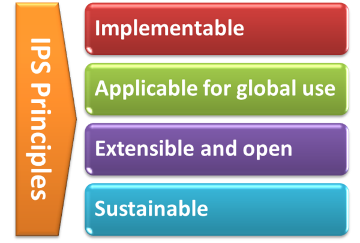

<!-- {:.no_toc} -->

<!-- TOC  the css styling for this is \pages\assets\css\project.css under 'markdown-toc'-->

* Do not remove this line (it will not be displayed)
{:toc}

# General Principles

The IPS Principles

See additional documentation in the IPS Wiki <a href="http://international-patient-summary.net/mediawiki/index.php?title=IPS_implementationguide_1#General_Principles_for_this_Specification">here</a>.

# Structuring Choices

The International Patient Summary is specified as a templated document using HL7 CDA R2 and as profiles using FHIR. The expressiveness of SNOMED CT and other primary terminologies enables this specification to represent the two general categories “condition/activity unknown” and “condition/activity known absent” in a style which is more independent of the underlying syntax (CDA R2 or FHIR), as explained in further detail <a href="http://international-patient-summary.net/mediawiki/index.php?title=IPS_implementationguide_1#Representing_.22known_absent.22_and_.22not_known.22">here</a>.

To be universally exchangeable and understood, a patient summary must rely as much as possible on structured data and multilingual international reference terminologies that are licensed at no cost for global use in the International Patient Summary. In the case of SNOMED CT, it is envisioned that SNOMED International could embrace the idea of a globally accessible open and free specification for the International Patient Summary that references a core set of globally accessible and usable value sets licensed at no-cost with the aim to serve the public good. In this spirit, this version of the International Patient Summary defines SNOMED CT as a primary terminology (the meaning of "primary terminology" is explained <a href="http://international-patient-summary.net/mediawiki/index.php?title=IPS_implementationguide_1#How_to_use_terminologies_.28preferred_binding.29">here</a>) and it is used in many of the value sets. To allow, however, a global and free implementation of the IPS this guide does not impose the usage of these SNOMED CT-based value sets. This choice may be revised in future versions. Other primary terminologies used in this specification are LOINC for observations (e.g., laboratory tests) and document sections, UCUM for units of measure, and EDQM Standard Terms for dose forms and routes. Looking at the availability of other globally usable reference terminologies, in selected cases FHIR-defined terminologies are recommended.

This specification (in common with the IPS CDA R2 specification) adopts <a href="https://art-decor.org">ART-DECOR®</a> as the primary source of terminologies for this Implementation Guide.

# Design Conventions and Principles

## Representing "known absent" and "not known"

In line with the approach followed for the IPS CDA implementation Guide, we enforce by design that for required sections the expressions of "known absent" and "not known" are explicitly asserted in the resource referred to in the entries and not by using the emptyReason attribute in the section.

This rule is applied for the following required sections: 
* Allergies and Intolerances
* Medication Summary
* Problems

The following sections are recommended (not required), and for these sections in the case of “unknown” or “no information” this may either be asserted explicitly (as above) or the section itself may be omitted:
* History of Procedures
* Medical devices
* Immunizations

All of the other sections are expected to be omitted in the case of absence of information.

## Translation of designations and narratives

The functional requirement of supporting the translation of the designations has been addressed in this guide extending the coding data type  (coding-uv-ips).

For details about the support of narrative translations please refer to the [Multi-Language support in FHIR](http://build.fhir.org/languages.html) section.

## Medicinal Product Identification

A general introduction to the problem of cross-jurisdictional identification of medicinal product is provided in the [IPS CDA implementation guide](http://international-patient-summary.net/mediawiki/index.php?title=IPS_Design_conventions_and_principles_1#Medicinal_Product_Identification)

As for the CDA implementation guide, this guide describes how the relevant IDMP identifiers and attributes, namely the Pharmaceutical Product Identifiers (PhPIDs), the Medicinal Product Identifier (MPID), and the Medicinal Product Package Identifier (PCID) are represented in the IPS.

The solution proposed for the FHIR IPS is slightly different from that adopted in the CDA and follows the current indications of the FHIR community: all the relevant product codes are represented in fact as one of the possible Codings of the product CodeableConcept, rather than being expressed as distinct attributes/resources (which is a possible approach). The same approach is followed for the vaccines.

## Provenance

This guide follows the principles described in the [IPS CDA implementation guide](http://international-patient-summary.net/mediawiki/index.php?title=IPS_Design_conventions_and_principles_1#Provenance)

In that sense it allows to determine whether the IPS document is constructed by a human or an automated process, regardless of whether the IPS contains some content of both kinds.

The distinction between the two types of IPS, human-curated or software-assembled, is based on the authors recorded in the composition: the author shall be a human (e.g. Practitioner), if the IPS provenance type is "human-curated", or a device if the IPS provenance type is "software-assembled".

In the case of a software-assembled IPS that is then verified by a human, the document provenance type shall be "software-assembled" and the author shall be the device or system that constructed the IPS document, but an additional attester identity shall name the human who performed this check.

Note: Discussions with the EHR work group suggest that a possible future project should be an IPS functional profile, once there is greater clarity and operational experience with usage of the IPS. 

## Representation of Names
This specification requires that any Person Name is represented including at least the given and family components.
Even though it is recognized that there is not in all cultures the same concept of “family name”, no evidence has been collected in analyzing the international context (e.g. Japan, Korea; China) that justifies the retirement of this requirement.
Moreover, due to the global scope of the International Patient Summary, the case of non-alphabetic representations of the names has also been considered.
In this case, to facilitate the global use of the IPS, at least one alphabetic representation of the name SHALL be provided. 

## Profiling approach (mustSupport)

By design, the IPS dataset is a "minimal and non-exhaustive patient summary dataset, specialty-agnostic, condition-independent, but readily usable by clinicians for the cross-border unscheduled care of a patient".

Two options were therefore available for the IPS profiles:
* constraining the resources to this dataset
* flag the items that have to be supported to comply with the minimal data set, unconstraining all the others.
 
The second has been finally chosen for the following reasons:
* facilitate the reuse of the IPS profiles in sibling  use cases.
* enable a progressive access to additional information beyond the minimal one, if available and relevant for the care provisioning.

The items that are part of this minimal set have been marked with the mustSupport attribute.

