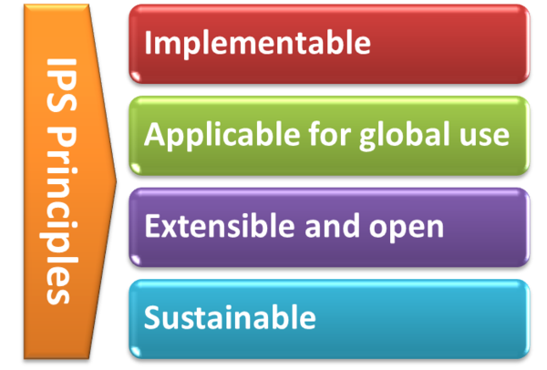

<!-- {:.no_toc} -->

<!-- TOC  the css styling for this is \pages\assets\css\project.css under 'markdown-toc'-->

* Do not remove this line (it will not be displayed)
{:toc}

With the formal agreement signed on April 2017, HL7 International and CEN/TC 251 expressed their intent to collaborate under a set of principles for the IPS.
<!--

The IPS Principles

-->



The standards specification for the IPS will be (a) implementable (b) applicable for global use (c) extensible and open to future use cases and solutions. The standards specification and their implementation must be moreover sustainable. 
See additional documentation in the <a href="http://international-patient-summary.net/mediawiki/index.php?title=IPS_implementationguide_1#General_Principles_for_this_Specification">IPS Wiki</a>.

# Structuring Choices

The International Patient Summary is specified as a templated document using HL7 CDA R2 and as profiles using FHIR. The expressiveness of SNOMED CT and other primary terminologies enables this specification to represent the two general categories “condition/activity unknown” and “condition/activity known absent” in a style which is more independent of the underlying syntax (CDA R2 or FHIR), as explained in further detail <a href="http://international-patient-summary.net/mediawiki/index.php?title=IPS_implementationguide_1#Representing_.22known_absent.22_and_.22not_known.22">here</a>.

To be universally exchangeable and understood, a patient summary must rely as much as possible on structured data and multilingual international reference terminologies that are licensed at no cost for global use in the International Patient Summary. In the case of SNOMED CT, it is envisioned that SNOMED International could embrace the idea of a globally accessible open and free specification for the International Patient Summary that references a core set of globally accessible and usable value sets licensed at no-cost with the aim to serve the public good. In this spirit, this version of the International Patient Summary defines SNOMED CT as a primary terminology (the meaning of "primary terminology" is explained <a href="http://international-patient-summary.net/mediawiki/index.php?title=IPS_implementationguide_1#How_to_use_terminologies_.28preferred_binding.29">here</a>) and it is used in many of the value sets. To allow, however, a global and free implementation of the IPS this guide does not impose the usage of these SNOMED CT-based value sets. This choice may be revised in future versions. Other primary terminologies used in this specification are LOINC for observations (e.g., laboratory tests) and document sections, UCUM for units of measure, and EDQM Standard Terms for dose forms and routes. Looking at the availability of other globally usable reference terminologies, in selected cases FHIR-defined terminologies are recommended.

This specification (in common with the IPS CDA R2 specification) adopts <a href="https://art-decor.org">ART-DECOR®</a> as the primary source of terminologies for this Implementation Guide.

# Publishing or accessing the IPS
As described also in the [IPS CDA implementation guide](http://international-patient-summary.net/mediawiki/index.php?title=IPS_implementationguide_1#Functional_requirements_and_high-level_use_cases) it is not in the scope of this version of this Implementation Guide to provide any indication about solutions and strategies for the creation, sharing, syntactical and semantic mapping, translation, and use of the IPS.

Future versions of this HL7 FHIR IPS Implementation Guide will address how to send/get IPS documents or resources by using FHIR APIs.
